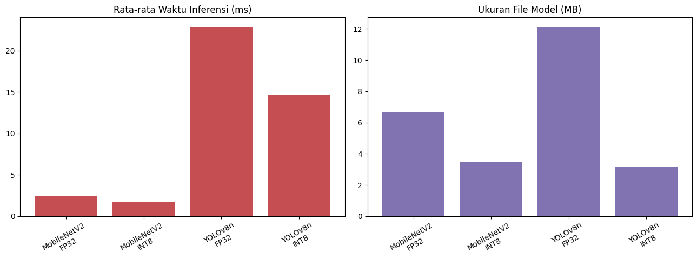
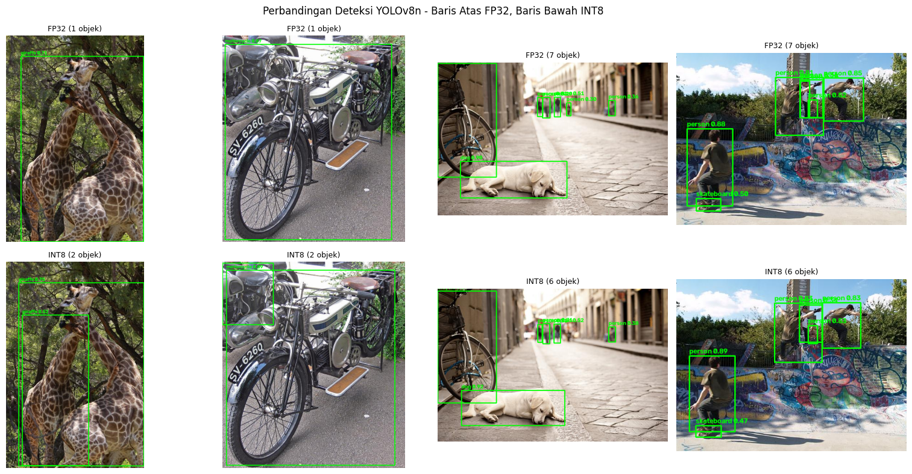
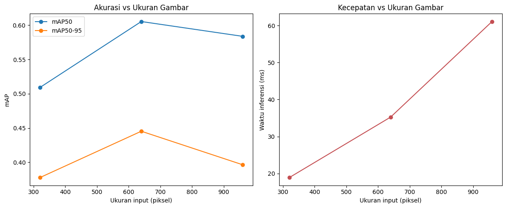
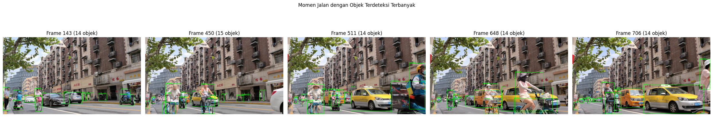
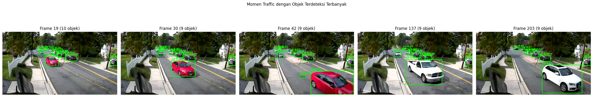
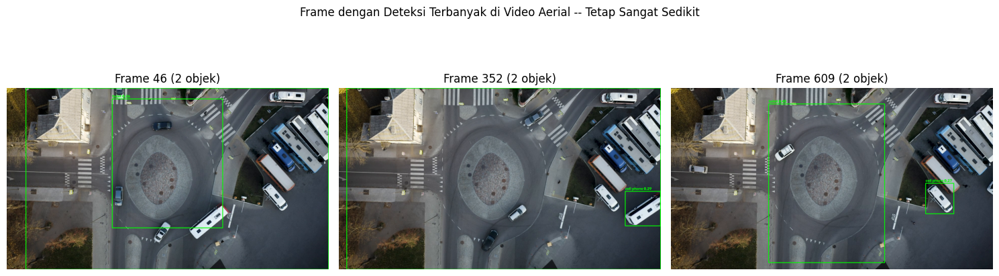

# Optimasi Computer Vision dengan OpenVINO: Quantization & Deteksi Real-Time

Optimasi model computer vision (klasifikasi MobileNetV2 + deteksi YOLOv8n) untuk inferensi real-time di CPU memakai OpenVINO dan quantization INT8 (NNCF), diuji pada rekaman CCTV asli.

[🇬🇧 Read in English](README.md)

## Cakupan proyek ini

- Konversi MobileNetV2 dan YOLOv8n ke format OpenVINO IR
- Quantization INT8 pasca-training dengan NNCF, dibandingkan terhadap FP32 dari sisi ukuran, kecepatan, dan akurasi
- Metodologi benchmark yang konsisten dan bisa direproduksi (warm-up run, banyak gambar berbeda, rata-rata ± standar deviasi) dipakai di setiap perbandingan
- Eksperimen langsung menguji trade-off ukuran gambar vs kecepatan vs akurasi
- Perilaku multi-threading / multi-processing dengan OpenVINO
- Tiga demo video dunia nyata, termasuk satu yang sengaja dipilih sebagai studi kasus keterbatasan model, bukan cerita keberhasilan

## Hasil utama (terverifikasi dari eksekusi kode asli)

### Quantization: ukuran, kecepatan, akurasi

| Model | Tipe | Ukuran | Latensi rata-rata (CPU) | Akurasi |
|---|---|---|---|---|
| MobileNetV2 | FP32 | 6.65 MB | 2.39 ± 0.05 ms | baseline |
| MobileNetV2 | INT8 | 3.46 MB (1.92× lebih kecil) | 1.75 ± 0.08 ms (1.37× lebih cepat) | 92.5% prediksi Top-1 sama dengan FP32 (37/40 gambar) |
| YOLOv8n | FP32 | 12.12 MB | 22.86 ± 3.44 ms | mAP50 0.604 / mAP50-95 0.451 |
| YOLOv8n | INT8 | 3.14 MB (3.86× lebih kecil) | 14.60 ± 0.55 ms (1.57× lebih cepat) | mAP50 0.618 / mAP50-95 0.455 |

mAP divalidasi memakai fungsi `val()` resmi Ultralytics terhadap label asli COCO128, bukan sekadar cek visual 1 gambar. Latensi diukur dengan 1 fungsi benchmark yang sama (5 run pemanasan, 15 gambar berbeda × 3 pengulangan = 45 sampel waktu per model), sehingga semua angka di atas bisa dibandingkan secara adil.



Menariknya, YOLOv8n INT8 justru sedikit *lebih unggul* dari FP32 di mAP pada run ini — pengingat bahwa quantization tidak selalu berarti kehilangan akurasi, apalagi di validation set yang kecil.



### Trade-off ukuran gambar vs kecepatan vs akurasi

| Ukuran input | mAP50 | mAP50-95 | Rata-rata waktu inferensi (CPU) |
|---|---|---|---|
| 320px | 0.509 | 0.378 | 18.9 ms |
| 640px | **0.605** | **0.445** | 35.3 ms |
| 960px | 0.584 | 0.397 | 61.1 ms |

Waktu inferensi naik konsisten seiring ukuran input membesar, tapi akurasi *tidak* — memuncak di 640px (resolusi training asli YOLOv8n) dan justru turun di 960px, bukannya terus membaik.



### Demo video real-time (CPU, model INT8)

| Demo | Frame | Rata-rata objek/frame | Rata-rata FPS |
|---|---|---|---|
| Traffic (kendaraan) | 265 | 7.12 | 59.5 |
| Jalan (orang, mobil, sepeda, motor) | 850 | 9.31 | 50.2 |
| Aerial (studi kasus keterbatasan) | 730 | 0.42 | 58.7 |





**Soal video aerial:** video ini sengaja dimasukkan untuk menunjukkan di mana model *gagal*, bukan cuma di mana model berhasil. Direkam dari sudut drone yang hampir tegak lurus ke bawah, video ini jelas berisi mobil dan bus yang terlihat kasat mata, tapi sebagian besar gagal terdeteksi YOLOv8n (rata-rata cuma 0.42 objek/frame) — ilustrasi nyata dari domain gap antara data training standar (sudut kamera miring/normal) dan kondisi penggunaan nyata ini.



## Tech stack

- **OpenVINO** (Intel) — konversi model (format IR) dan inferensi CPU
- **NNCF** — quantization INT8 pasca-training
- **Ultralytics YOLOv8n** — deteksi objek, sekaligus fungsi `val()`-nya untuk validasi mAP resmi
- **MobileNetV2** (pretrained ImageNet) — klasifikasi gambar
- **OpenCV** — pre/post-processing dan I/O video
- COCO128 — kalibrasi quantization dan pengujian akurasi banyak gambar

## Sumber video

Seluruh rekaman demo adalah video CCTV asli (bukan hasil generate AI), masing-masing dengan lisensi pakai-ulang yang jelas:

- Demo traffic — [`ahmetozlu/tensorflow_object_counting_api`](https://github.com/ahmetozlu/tensorflow_object_counting_api) (MIT License)
- Demo jalan — [Pixabay](https://pixabay.com/id/videos/jalan-lalu-lintas-rakyat-perkotaan-86656/) (Pixabay License)
- Demo aerial — Mixkit (Mixkit Free License)

## Struktur repo

```
├── OpenVINO_CV_Quantization_Explore.ipynb   # Notebook lengkap (Colab, GPU/CPU)
├── images/                                   # Dokumentasi hasil dari run asli
├── README.md
├── README.id.md
└── LICENSE
```

## Menjalankan sendiri

Buka notebook di Google Colab. Tahap 2 akan meminta upload 2 file video (klip jalan dan klip aerial) — sisanya, termasuk video traffic dan semua model, diunduh otomatis.

## Lisensi

MIT — lihat [LICENSE](LICENSE).
